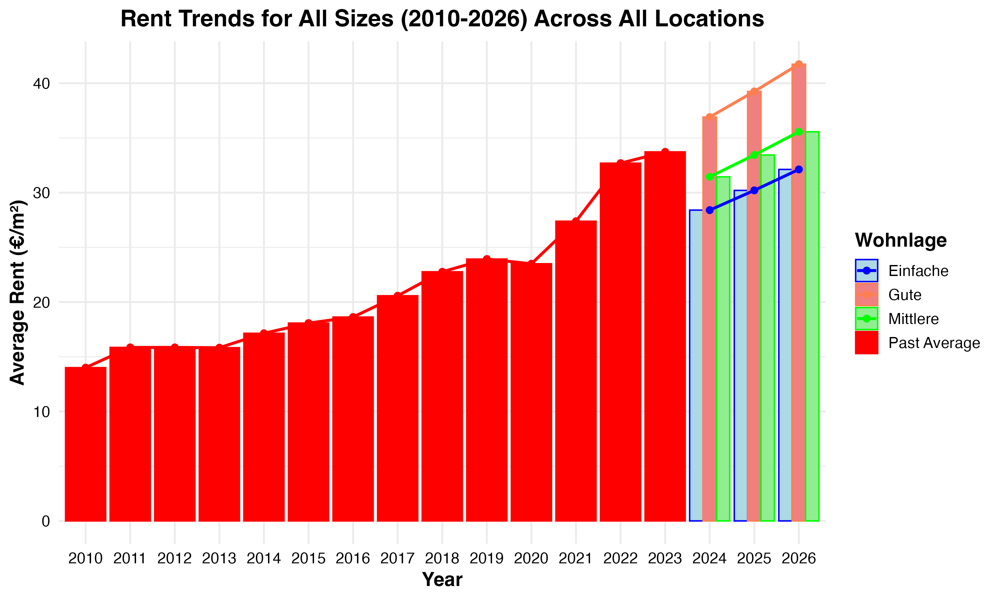

# berlin-rent-trend
Analysis of Berlin rent trends from 2010 to 2026 using R and ggplot2
# Berlin Rent Trends Analysis (2010–2026)

This project analyzes rent trends in Berlin from 2010 to 2026 using historical data and Mietspiegel projections. The analysis is performed in R, and the results are visualized using `ggplot2`.

## Project Overview
- **Objective**: Analyze historical rent prices in Berlin (2010–2023) and project future rents (2024–2026) across different `Wohnlage` categories (Einfache, Mittlere, Gute).
- **Data Sources**:
  - Historical rent prices (`historical_prices_berlin.csv`)
  - Berlin flats data (`berlin_flats-till2020.csv`)
  - Mietspiegel 2024 data (`einfache_wohnlage.csv`, `mittlere_wohnlage.csv`, `gute_wohnlage.csv`)
  - PLZ geospatial data (`plz.geojson`)
- **Tools**: R, `tidyverse`, `sf`, `ggplot2`

## Files
- `updated rent_trends_analysis.R`: The R script containing the full analysis, including data processing, calculations, and visualization.
- `rent_trends_chart2.png`: The final chart showing rent trends from 2010 to 2026.

## Chart

## How to Run
1. Ensure you have R installed with the following packages: `tidyverse`, `sf`.
2. Place the data files in the same directory as the script.
3. Run `rent_trends_analysis.R` in R or RStudio.
4. The script will generate the chart and save it as `rent_trends_chart.png`.

## Notes
- The data files are not included in this repository due to size constraints but can be provided upon request.
- The chart shows a steady trend due to the consistent growth rate in historical data and the averaging across PLZ codes.

